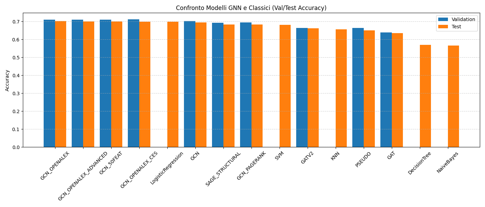
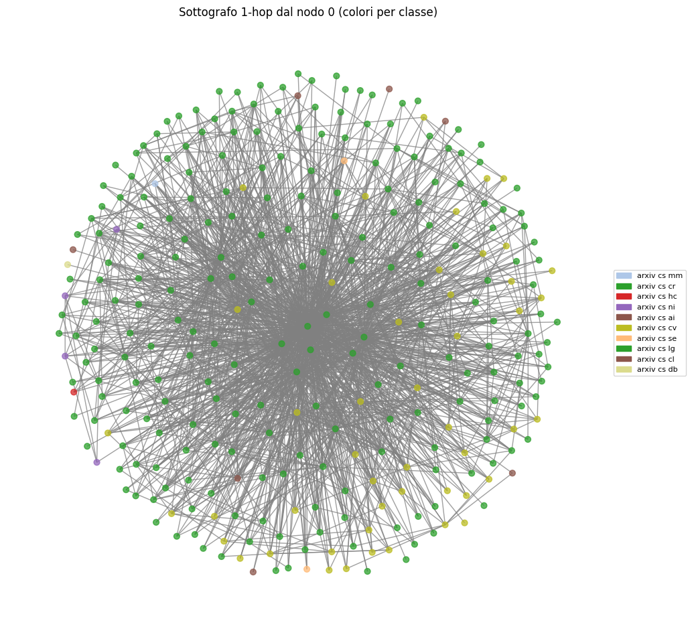

# Graph-Based Scientific Paper Recommendation

**Graph learning and metadata-aware recommendation over a scientific citation network**

This project studies scientific-paper recommendation by combining graph representations, learned node embeddings and bibliographic metadata. It includes exploratory data mining, classical machine-learning baselines, Graph Neural Network experiments and an interactive Streamlit application.

**Motivation:** paper relevance is not captured by title keywords alone. Citation-network proximity can reveal relationships between publications, while bibliographic attributes provide interpretable ways to adapt recommendations. The project explores **how to combine learned graph-based similarity with metadata-aware ranking**.

### Architecture and project walkthrough

- [System design — offline graph experiments, online recommendation, two Mermaid diagrams and technical decisions](docs/SYSTEM_DESIGN.md)
- [Guida italiana — problema affrontato, spiegazione semplice e preparazione al colloquio](docs/PROJECT_WALKTHROUGH_IT.md)

**Important boundary:** GNN/model experiments run **offline**. Streamlit loads a **precomputed node-embedding tensor** and a metadata table; no GNN training or message passing happens during an interactive title search.

## What the project explores

The experimental workflow compares several approaches:

- classical ML baselines;
- structural graph features;
- PCA / t-SNE analysis;
- Graph Convolutional Networks;
- GraphSAGE;
- Graph Attention Networks;
- learned node embeddings;
- ensemble comparisons.

The recommendation application uses learned graph embeddings together with publication metadata to rank papers related to a user-selected title.

## Recommendation pipeline

```text
Paper / title query
        ↓
Exact or fuzzy matching
        ↓
Graph embedding lookup
        ↓
Cosine similarity
        ↓
Metadata-aware re-ranking
        ↓
Interactive recommendations
```

The **additive score** is cosine similarity + configurable same-category bonus + shared-author bonus + PageRank contribution. Citation thresholds and scientific concepts act as **filters**, not direct score terms.

## Interactive application

The Streamlit application is implemented in `streamlit_app.py` and provides:

- GitHub OAuth identity integration (prototype; recommendations are not fully authorization-gated);
- exact and fuzzy title search;
- embedding-based similarity;
- configurable ranking weights;
- metadata filters;
- recommendation cards;
- session-only favourites (not persisted in a user database);
- CSV export.

OAuth credentials are read from Streamlit secrets and are never committed.

## Representative results

### Model comparison



### Citation-network neighbourhood



Additional figures retained for documentation cover degree distribution and XGBoost feature importance.

## Data enrichment

`scripts/openalex_enrichment.py` enriches publication identifiers through the OpenAlex API with metadata including:

- title;
- authors;
- institutions;
- concepts;
- citation count;
- publication date.

## Repository structure

```text
Data-Mining-Streamlit/
├── streamlit_app.py
├── notebooks/
│   └── graph_recommendation_analysis.ipynb
├── scripts/
│   └── openalex_enrichment.py
├── data/
│   └── README.md
├── checkpoints/
│   └── README.md
├── docs/
│   └── figures/
├── requirements.txt
├── runtime.txt
└── README.md
```

Large experiment outputs, prediction arrays, training checkpoints, generated HTML visualizations and intermediate datasets are intentionally excluded from the portfolio repository.

## Setup

```bash
python -m venv .venv
source .venv/bin/activate
pip install -r requirements.txt
```

Configure GitHub OAuth:

```bash
mkdir -p .streamlit
cp .streamlit/secrets.toml.example .streamlit/secrets.toml
```

Then provide the two **required but not tracked** runtime artifacts described in:

- [Metadata table: `data/df_final3.csv`](data/README.md)
- [Embedding tensor: `checkpoints/deepgcn_node_embeddings.pt`](checkpoints/README.md)

**Without these files, the application stops with an explanatory error.** The stored `node_idx` mapping must match the rows of the embedding tensor. The GitHub OAuth integration additionally requires appropriate secrets in `.streamlit/secrets.toml`.

Run the app with:

```bash
streamlit run streamlit_app.py
```

## Tech stack

Python · PyTorch · Graph Neural Networks · scikit-learn · Pandas · NumPy · NetworkX · Streamlit · OpenAlex · OAuth · RapidFuzz

## Author

**Paolo Pangallo**  
M.Sc. Computer Engineering — Artificial Intelligence  
University of Calabria
