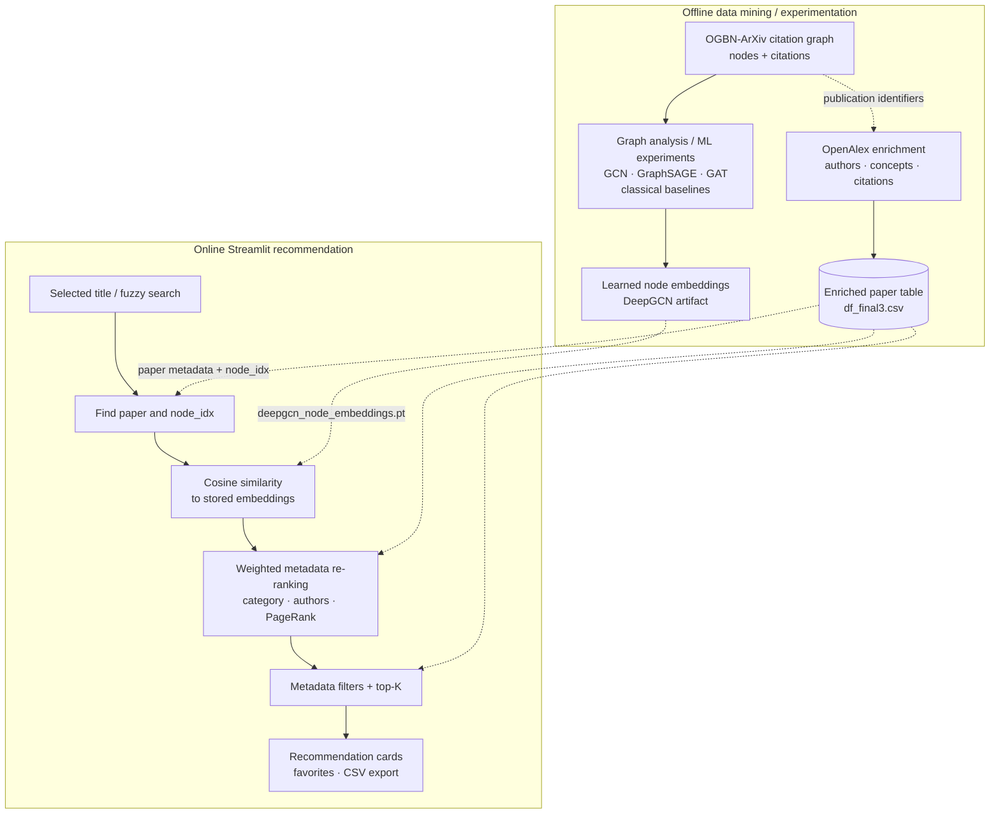
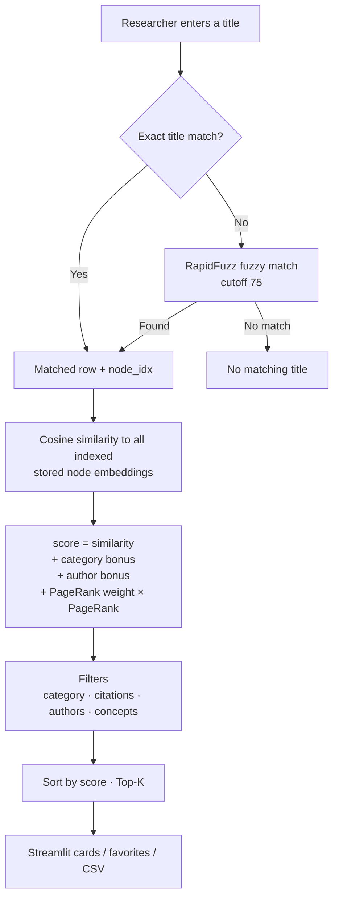

# Graph-Based Scientific Paper Recommendation — System Design

> **Graph representation learning + bibliographic signals for explainable, adjustable paper discovery.**
>
> [Repository](../README.md) · [Research notebook](../notebooks/graph_recommendation_analysis.ipynb) · [Italian walkthrough](PROJECT_WALKTHROUGH_IT.md)

## 1. Motivation: what problem are we solving?

A paper can be relevant for more than its title keywords. Scientific literature forms a **citation network**: a publication is connected to other publications through references, while metadata such as subject category, authors, concepts, citation count and publication year adds further context.

The core question is:

**Can a representation learned from a citation graph help retrieve related papers, and can bibliographic signals make the ranking more useful and controllable to the researcher?**

A purely lexical search may miss graph proximity. A graph representation can capture network relationships, but a similarity-only ranking can overlook user preferences. The project explores these complementary signals through offline graph-learning experiments and a simple interactive recommender.

### Scope

- Explore a scientific citation network and alternative ML/GNN representations.
- Compute and use graph-based node embeddings for paper similarity.
- Enrich publications with metadata from OpenAlex, and combine that metadata with graph signals.
- Provide an interactive Streamlit interface with adjustable ranking and filters.

**Not demonstrated:** a production paper-search engine, a quantitative improvement over all baselines, real-time GNN inference for each search, or a public hosted app that works without its missing runtime artifacts.

## 2. Two separate workflows: offline research and online recommendation

The most important architectural boundary is between **offline model/data preparation** and **online retrieval using already saved embeddings**.



**This is a conceptual system map.** The repository README describes several research-model families and retains an exploratory notebook and figures. The Streamlit code only **loads a pretrained embedding tensor**; it does not train or execute GNN message passing at request time. The offline notebook is a research artifact, not a guaranteed single reproducible build pipeline for the two absent production inputs.

### Runtime artifacts

| File | Purpose | Included in repository? |
| --- | --- | --- |
| `notebooks/graph_recommendation_analysis.ipynb` | Historical analysis and graph-learning experiments | Yes |
| `data/df_final3.csv` | Paper metadata, ranking features and `node_idx` | **No** — generated data |
| `checkpoints/deepgcn_node_embeddings.pt` | Final graph-node embedding tensor | **No** — trained artifact |
| `docs/figures/*.png` | Historical charts for the README | Yes |
| `scripts/openalex_enrichment.py` | OpenAlex data-enrichment utility | Yes |

The application explicitly checks for the absent CSV and embedding file, displays an error if either is missing, and stops. This is a reproducibility limitation; setup instructions alone do not supply the actual dataset or trained embeddings.

## 3. Online recommendation: real request flow

The implementation is in [`streamlit_app.py`](../streamlit_app.py).



### The score is explicitly configurable

For a candidate paper `j` relative to the selected query paper `q`, the code computes:

```text
score(q, j) = cosine(embedding[q], embedding[j])
            + category_boost * same_category(q, j)
            + author_boost   * shares_author(q, j)
            + pagerank_weight * PageRank(j)
```

- **Embedding similarity** is the content/graph-representation signal.
- **Category bonus** is added when both papers belong to the same configured category.
- **Author bonus** is added when they have a common author.
- **PageRank** is a structural popularity/centrality signal already present in the metadata.
- **Hard filters** (categories, minimum citations, shared authors, selected concepts) are applied before selecting the final Top-K.
- The selected seed paper itself is excluded from recommendations.

**Important mathematical distinction:** no citation-count term or concept-similarity term appears directly in the score. Citations and concepts are **filters**. Publication year is displayed, rather than being a ranking component. The raw sum of weighted terms is a prototype choice: features are not calibrated to a common scale, so PageRank weight and bonus selection can substantially change the ordering.

### Identity alignment is fundamental

`node_idx` links metadata rows to the embedding tensor. The app looks up the query embedding with `embeddings_np[info["node_idx"]]` and computes similarities against `embeddings_np[node_idx_list]`.

This assumes every index is valid and refers to the **same graph node in both artifacts**. There is currently no formal artifact manifest (graph snapshot, node mapping, checkpoint hash), so misaligned files could produce convincing-looking but incorrect recommendations.

## 4. Why graph learning and why metadata-aware re-ranking?

| Decision | Motivation | Trade-off |
| --- | --- | --- |
| Citation graph | Encodes relationships between publications that are not apparent from title strings alone | Graph links may reflect citation patterns or popularity, not necessarily topical relevance |
| GNN / embedding experiments | Learn vectors informed by graph structure; explore alternatives to handcrafted features | Representation quality depends on training objective, graph split, model and data preparation |
| **Offline** learned embeddings | Low-complexity query-time similarity without running a GNN for every interaction | New articles or changed graph edges require embedding/data refresh |
| Cosine similarity | Transparent and easy to compute over normalized vectors | Similarity alone can rank popular or locally related but irrelevant papers |
| Bibliographic bonuses | Combine network representation with explainable domain-specific preferences | Manual weight tuning is subjective and lacks fitted calibration |
| PageRank | Supply graph-global importance as a ranking signal | Can favor established/highly connected papers over niche or newer work |
| OpenAlex | Add authors, affiliations, concepts, citations and dates | External API identifiers, rate limits and missing/ambiguous metadata matter |
| Streamlit | Rapid creation of an interactive research prototype with sliders, filters and export | Single-script coupling of UI, ranking and authentication complicates production maintenance |

## 5. Research side: what should be attributed to the notebook?

The [README](../README.md) describes investigations into:

- classical ML baselines and structural graph features;
- PCA and t-SNE;
- graph convolutional networks, GraphSAGE and graph attention networks;
- learned embeddings and ensemble model comparisons.

The repository retains the research notebook and original figures such as [model comparison](figures/model_comparison.png), [degree distribution](figures/degree_distribution.png) and [feature importance](figures/xgb_top_features.png).

**Evidence boundary:** these files establish the reported research directions, but this document does not claim a verified model ranking, exact accuracy values, or independently reproduced experiments. The notebook is large and experimental; specific quantitative statements must be checked against its original evaluation cells, dataset splits and hyperparameters before publication.

In particular, the **running recommender** refers to a **DeepGCN embedding artifact**, not an online ensemble of all the models mentioned in the README.

## 6. User experience and supporting services

### Streamlit

The script provides a title query, adjustable `top_k` and scoring weights, category/author/concept filters, citation thresholds, recommendation cards, session favorites and CSV export.

### GitHub OAuth

GitHub OAuth is integrated for identity/display using `Authlib`. Tokens and temporary state are kept in Streamlit session state, while client credentials are configured via Streamlit secrets.

**Implementation caveat:** the current source displays a login option for unauthenticated visitors but does not clearly enforce an authorization gate around the full recommendation workflow. It should therefore be presented as an **OAuth integration in a prototype**, not as fully protected access control. Favorites also reside in session state, **not** a persistent multi-user database.

### OpenAlex ingestion

The enrichment script reads publication identifiers, makes HTTP requests to OpenAlex, extracts titles/authors/institutions/concepts/citation counts/dates, and writes CSV results.

It is **not** a live dependency of the Streamlit request path. Further hardening is needed before treating it as a durable ingestion pipeline: identifier mapping, errors/rate limits and incremental threaded writes require testing.

## 7. Architecture limitations and research integrity

- The repository intentionally **does not include the required metadata CSV or embedding tensor**, so a clone cannot execute the full recommender until those artifacts are supplied.
- The model-training and feature-generation code lives in a research notebook; it is not packaged as a deterministic data+model build command.
- No checkpoint-to-`node_idx` manifest validates metadata and embedding alignment.
- Query ranking is a weighted additive heuristic, not a learned-to-rank system. The weights have no demonstrated calibrated optimum.
- The interface displays metadata through `unsafe_allow_html=True` string interpolation. **Escaping/sanitizing untrusted metadata is necessary** before public deployment.
- GitHub OAuth is not equivalent to fully gated authenticated endpoints in the current script.
- The OpenAlex enrichment utility's threading and incremental CSV writes are experimental and should be audited for reliable accumulation across batches.
- Historical charts do not in themselves establish an unbiased offline recommendation benchmark. There are no reproduced precision@K, recall@K, NDCG, or user-study results asserted here.
- The app is designed for papers already represented in the saved graph embeddings, not arbitrary newly published papers.

### Next experiments worth doing

1. Freeze graph and metadata snapshots and provide a **reproducible node-id mapping**.
2. Build or document an artifact-generation protocol from graph to embeddings and enriched table.
3. Evaluate embedding-only similarity versus metadata re-ranking with held-out links or a clearly defined relevance proxy; report ranking metrics and uncertainty.
4. Perform an ablation study over category/author/PageRank weights; tune on a validation split only.
5. Audit OAuth protection, metadata HTML escaping and enrichment writer behavior before hosting publicly.
6. Make inference components independently testable while preserving the exploratory notebook.

## 8. Source map

- [Streamlit app: title matching, ranking, filters and UI](../streamlit_app.py)
- [Research notebook](../notebooks/graph_recommendation_analysis.ipynb)
- [OpenAlex enrichment](../scripts/openalex_enrichment.py)
- [Runtime metadata contract](../data/README.md)
- [Runtime embedding contract](../checkpoints/README.md)
- [Dependencies](../requirements.txt)

**Design takeaway:** graph embeddings offer a notion of relatedness learned from a citation network, while metadata-aware ranking makes that relation adjustable to a researcher's preferences. The app is a working design for exploring that combination, but fully reproducible artifacts and measured ranking quality remain separate tasks.
